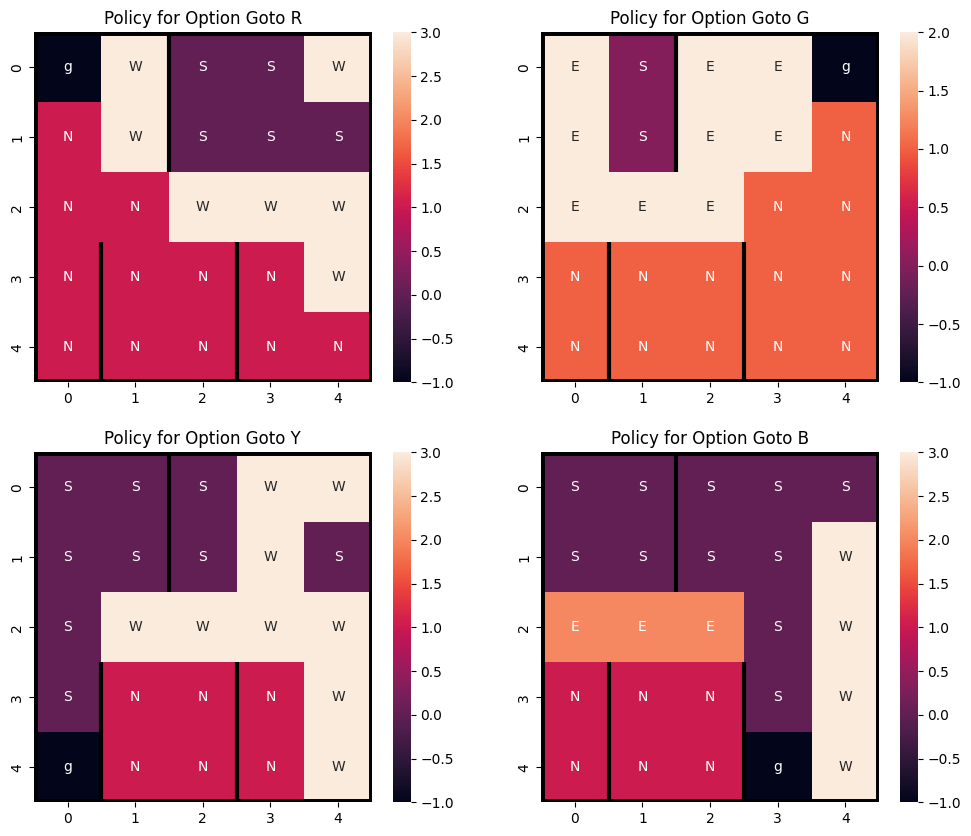
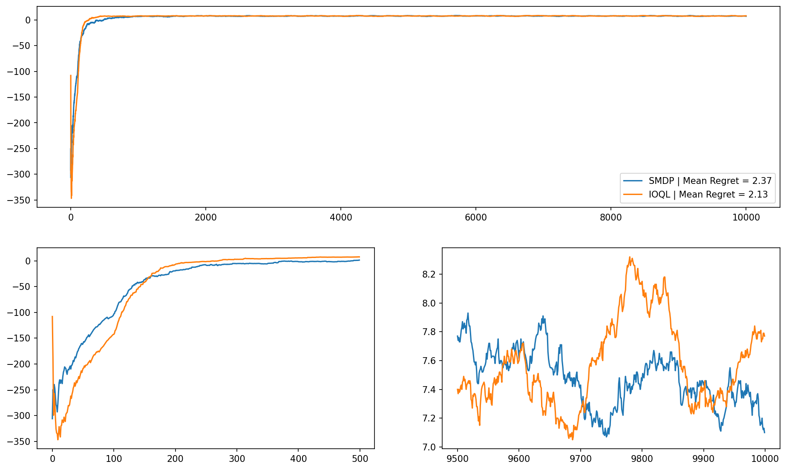
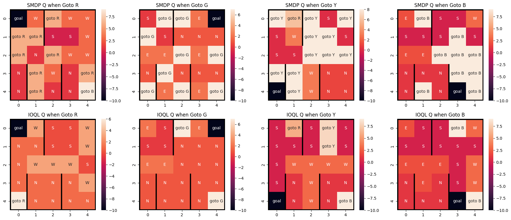
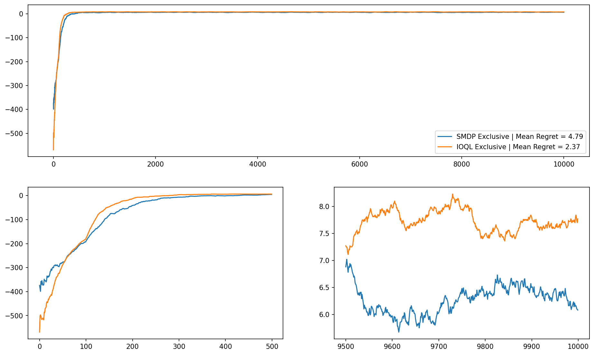
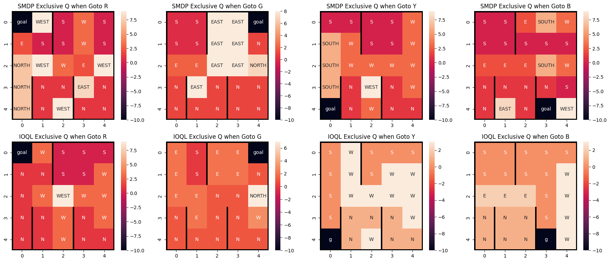

# CS6700: Reinforcement Learning (Jan-May 2024) Programming Assignment 3

Vivek Sivaramakrishnan NS24Z170
Pooja Pandey NS24Z172



# Defining Options

An option consists of 3 components:

-   An initiation set
-   A policy
-   A termination set (*β* = 0 or 1 for any state, can be considered as
    a set of states)

In the Taxi-v3 problem, we design options to be initiated from anywhere
in the state space. Thus, we only have 2 varying components among the
options: the option *policy* and *termination* set. We use a
`collections.namedtuple` structure to store the policy (a callable
function) and termination set of states for our option:

``` maarkdown
Option = namedtuple('Option', ['policy', 'terminate'])
```

## Primitive Actions

In line with the [Recent Advances in Hierarchical Reinforcement
Learning](https://people.cs.umass.edu/~mahadeva/papers/hrl.pdf) paper,
we define primitive actions to be *one-step* options; that is:

-   For primitive action *A*, `Option_A.policy(s) = A` for all `s`.
-   The termination set is the entire state space.

Following the above, we define our *one-step* options as follows:

``` maarkdown
grid = [(i, j) for i in range(5) for j in range(5)]

S = Option(lambda state: 0, grid)
N = Option(lambda state: 1, grid)
E = Option(lambda state: 2, grid)
W = Option(lambda state: 3, grid)
P = Option(lambda state: 4, grid)
D = Option(lambda state: 5, grid)
```

## Option `Goto X`

The option `Goto X` moves the taxi to `X`.

Defining the termination set for the option is straightforward; we store
only the first 2 values of the 4-tuple state. This can be obtained from
an encoded state using the following `decode` function:

``` maarkdown
decode = lambda state: tuple(env.unwrapped.decode(state))[:2]
```

One can set

``` maarkdown
Option_Goto_R.terminate = {(0, 0)}
```

and then run

``` maarkdown
decode(state) in Option_Goto_R.terminate
```

to check if option has terminated.

The policy for the option however has to be learned. For this, we employ
Vanilla Q-Learning.

### Vanilla Q-Learning to learn `Goto X` option policies

We use Vanilla Q-Learning over primitive actions (or, equivalently SMDP
over only *one-step* options) to solve the Taxi environment. We then
extract policies for `Goto X` from the learnt Q-Function as follows:

-   In the 4-tuple representation of the state, fix passenger location
    to *X*, and the destination to any *k* ≠ *X* (we use
    (*X*+1) mod  4). Only 25 states, of the form
    (*i*,*j*,*X*,(*X*+1) mod  4) satisfy the constraint.
-   Taking a cross-section of the Q-Table on this set of states,
    reshaping result to 5 × 5 × 6, and arg max  (or *ϵ*-greedy) along
    the 3rd axis gives the policy for this option.

``` maarkdown
policy_grids = []
for k in range(4):
    policy_grid = Q[[env.unwrapped.encode(i, j, k, (k+1)%4) for i in range(5) for j in range(5)]].reshape(5, 5, 6).argmax(axis=2)
    
    policy_grids.append(policy_grid)
```

Performing the above gives the following (deterministic) option
policies:



We pass obtained policy grids through a function decorator to generate
the policy function. We further define our `Goto X` options using the
generated policy functions and termination states as follows:

``` maarkdown
macro_options = []
option_policy_generator = lambda grid: (lambda state: (grid[decode(state)]))
option_terminations = [(0, 0), (0, 4), (4, 0), (4, 3)]

for policy_grid, term_state in zip(policy_grids, option_terminations):
    policy_func = option_policy_generator(policy_grid)
    option = Option(policy_func, [term_state])
    macro_options.append(option)

R, G, Y, B = macro_options
```

## Mutually Exclusive Options

We define options `NORTH`, `SOUTH`, `EAST` and `WEST` which keep moving
the taxi in their respective direction till they encounter an
*obstruction*. These options are mutually exclusive because the option
policies are pairwise non-consistent on all states *s*.

In our design of the options, we set the termination states to be the
states adjacent to these obstructions:

``` maarkdown
SOUTH = Option(lambda state: 0, [(4, i) for i in range(5)])
NORTH = Option(lambda state: 1, [(0, i) for i in range(5)])

EAST = Option(lambda state: 2, [(i, 4) for i in range(5)] + [(0, 1), (1, 1), (3, 0), (4, 0), (3, 2), (4, 2)])
WEST = Option(lambda state: 3, [(i, 0) for i in range(5)] + [(0, 2), (1, 2), (3, 1), (4, 1), (3, 3), (4, 3)])
```

# Tasks

## Hyperparameter tuning

The Optuna Framework is used to search for the optimal values of the
following hyperparameters:

-   Learning rate *α*
-   *ϵ* in *ϵ*-greedy selection

50 Trials were run on each of the algortihm configurations (SMDP, IOQL
on 2 option configurations). The results are stored in `hpt_results.db`
which can be browsed through using *Optuna Dashboard*. The
hyperparameters found is listed below:

<table>
<thead>
<tr class="header">
<th>Algorithm</th>
<th>Options</th>
<th>Alpha</th>
<th>Epsilon</th>
</tr>
</thead>
<tbody>
<tr class="odd">
<td>SMDP</td>
<td><code>Goto X</code></td>
<td>0.5777660</td>
<td>0.0046396</td>
</tr>
<tr class="even">
<td>IOQL</td>
<td><code>Goto X</code></td>
<td>0.7365430</td>
<td>0.0014736</td>
</tr>
<tr class="odd">
<td>SMDP</td>
<td>Mutually Exclusive</td>
<td>0.8030125</td>
<td>0.0005293</td>
</tr>
<tr class="even">
<td>IOQL</td>
<td>Mutually Exclusive</td>
<td>0.8028770</td>
<td>0.0002563</td>
</tr>
</tbody>
</table>

## One-Step + `Goto X` Options

### Plot

The running average over 100 episodes is plotted. The 2 plots below are
just zoomed in to the original plot (performance on first and last 500
out of 10000 episodes):



### Q-value visualization



It can be observed that the IOQL policy chooses one-step options more
often than the SMDP policy. This can be due to the fact that one-step
options / primitive actions are updated more frequently due to
intra-option updation during option progression, over SMDP where
frequency of updations of one-step vs. macro options is roughly the
same.

## One-Step + Mutually-Exclusive Options

### Plot



### Q-value visualization



The learnt policies follow the same behaviour as described in
[Section 2.2.2](#sec-qval).

**IOQL**: We observe that the advantage IOQL boasts of increased number
of updates on consistent policies is significantly reduced here;
choosing a macro option results in its own and only the corresponding
primitive actions’ update. This reduces the sampling efficiency of the
model, as indicated by the increase in regret from 2.13 (in
[Section 2.2.1](#sec-plot1)) to 2.37.

**SMDP**: The options are not useful / don’t fit in naturally to the
temporal hierarchical abstraction of the problem. Since SMDP unlke IOQL
does not update primitive actions during option execution, and the fact
that updation frequency of macro vs one-step options is roughly the
same, the algorithm struggles in its pursuit for the optimal policy, as
shown by the drastic increase in regret from 2.37 (in
[Section 2.2.1](#sec-plot1)) to 4.79.

## Comparison between SMDP Q-Learning and Intra Option Q-Learning:

-   In SMDP Q-Learning only one Q-learning update is performed at the
    state where the option was initated, after its termination.
-   Intra-Option Q-Learning however is like a relational database; since
    mutually exclusive and indivisble components (primitive actions) are
    re-used to form bigger macro options, a state-transition accounts
    for much more updates (no. of consistent option policies) over SMDP.
-   This makes IOQL more sample-efficient than SMDP, as shown by the
    regrets achieved by the respective algorithms in
    [Section 2.2.1](#sec-plot1) and [Section 2.3.1](#sec-plot2).
-   Therefore IOQL is most suitable for the options framework, which is
    a composition of primitive actions. The options can be viewed as a
    user defined heuristic which pushes Q-Learning to traverse through
    important sections of the state space.
-   SMDP Q-Learning’s apt use case would rather be in actions that
    actually have varying times while being atomic; that is, they are
    not compositions of other actions (options).
